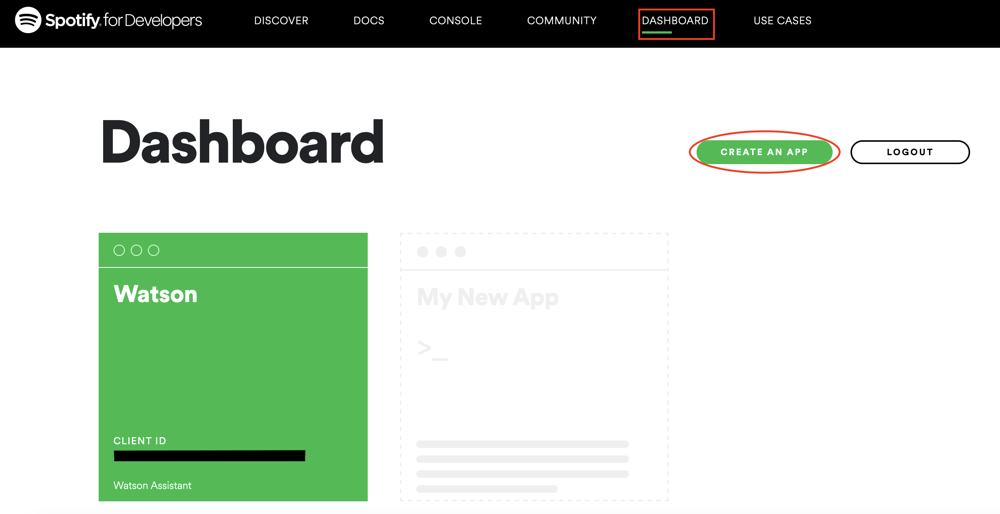

<h1 align="center" style="border-bottom: none;">🤖 IBM Watson Assistant  Tutorial 🤖</h1>
<h3 align="center">In this tutorial you will see how to link the IBM Cloud Watson Assistant to the Spotify API using Python and the IBM Cloud Functions to search for songs, albums or artists. </h3>


## Prerequisites

1. Sign up for an [IBM Cloud account](https://cloud.ibm.com/registration).
2. Fill in the required information and press the „Create Account“ button.
3. After you submit your registration, you will receive an e-mail from the IBM Cloud team with details about your account. In this e-mail, you will need to click the link provided to confirm your registration.
4. Now you should be able to login to your new IBM Cloud account ;-)
5. Also sign up for an [Spotify Developer account](https://developer.spotify.com/dashboard/login).
6. Lastly install [Python](https://www.python.org/downloads/) and a coding environment like [Visual Studio](https://www.python.org/downloads/) for example.

## Setting up Spotify API

<h4>1) Create an Spotify App</h4>
After the login you will see your Spotify Developer Dashboard. There you will have to create an app. Give it a name, click on Create and it should look similar to the screenshot.



<h4>2) Get credentials</h4>
Now navigate to the app and you should find the Client ID and below that the Client Secret (click on "Show Client Secret" to view it). Save the two somewhere safe because we will need them soon in our Python Code.


## Connect to the Spotify API 

<h4>1) Install Spotipy</h4>
Go to your prefered coding environment and open your terminal to install [Spotipy](https://spotipy.readthedocs.io/en/2.17.1/) is a Python library to work with the Spotify Web API. Use the following command: 

```
pip install spotipy
```
or to upgrade:

```
pip install spotipy --upgrade
```
<h4>1) Access API</h4>
Now create an python file in your coding environment and import Spotipy:  
```
import spotipy
from spotipy.oauth2 import SpotifyClientCredentials
```
To access the Spotify API we need to establish a connection and provide the API with the required credentials. 
Create two string variables ```called client_id ``` and ```client_secret``` and assign them the Client ID and Client Secret we saved earlier.


## If you have any questions just contact me
Sami Haddouti<br>
LinkedIn: [linkedin.com/in/samihaddouti](https://www.linkedin.com/in/samihaddouti/)
