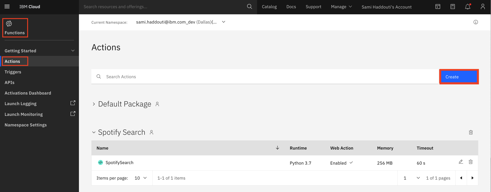

<h1 align="center" style="border-bottom: none;">🤖 IBM Watson Assistant  Tutorial 🤖</h1>
<h3 align="center">In this tutorial you will see how to link the IBM Cloud Watson Assistant to the Spotify API using Python and the IBM Cloud Functions to search for songs, albums and artists. </h3>

## Prerequisites

1. Sign up for an [IBM Cloud account](https://cloud.ibm.com/registration).
2. Fill in the required information and press the „Create Account“ button.
3. After you submit your registration, you will receive an e-mail from the IBM Cloud team with details about your account. In this e-mail, you will need to click the link provided to confirm your registration.
4. Now you should be able to login to your new IBM Cloud account ;-)
5. Also sign up for an [Spotify Developer account](https://developer.spotify.com/dashboard/login).
6. Lastly install [Python](https://www.python.org/downloads/).

## Setting up Spotify API

<h4>1) Create an Spotify App</h4>
After the login you will see your Spotify Developer Dashboard. There you will have to create an app. Give it a name, click on Create and it should look similar to the screenshot.

&nbsp;

<h4>2) Get credentials</h4>
Now navigate to the app and you should find the Client ID and below that the Client Secret (click on "Show Client Secret" to view it). Save the two somewhere safe because we will need them soon in our Python Code.  

&nbsp;

##  Building our Cloud Function 

<h4>1) Create a Cloud Function </h4>
Go to the IBM Cloud website, log in and search for Cloud Functions. You could also look for Functions in the IBM Cloud catalog. 
Now navigate to Actions and create a new Action. The name and package is up to you, but don't forget to set the Runtime to Python.

&nbsp;

Copy and Paste the Python Code from the SpotifySearch.py file in your action. Most of the code is explained with comments but if you find something odd or encounter problems don't bother to ask.

In your action dashboard go to Endpoints and write down the REST API URL and the API KEY which consists of a username (everthing in front of the colon = :) and a password (the rest after the colon). We will need the URL and authentication for later to link our function to the assistant.

## If you have any questions just contact me
Sami Haddouti 
LinkedIn: [linkedin.com/in/samihaddouti](https://www.linkedin.com/in/samihaddouti/)
